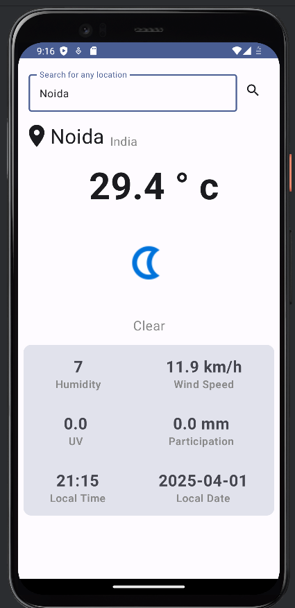
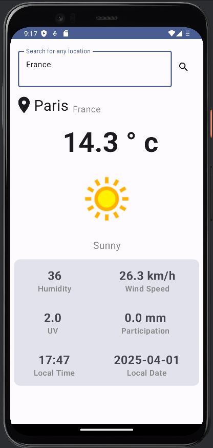

# Weather App - API Integration with Retrofit

This is a simple **Weather App** built using **Kotlin** and **Jetpack Compose**, which fetches real-time weather data using **Retrofit** and displays it in a user-friendly UI.

## Features
- Fetches real-time weather data using an API.
- Uses **Retrofit** for API integration.
- Displays temperature, humidity, wind speed, and weather conditions.
- Modern UI using **Jetpack Compose**.
- Handles errors and network failures gracefully.

## Screenshots

## Tech Stack
- **Language:** Kotlin
- **Framework:** Jetpack Compose
- **Networking:** Retrofit, Gson
- **Architecture:** MVVM
